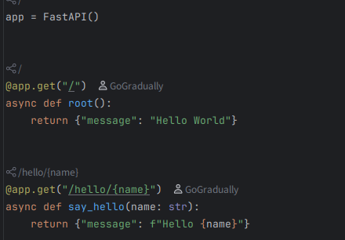
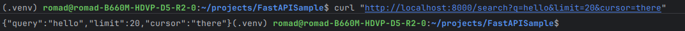
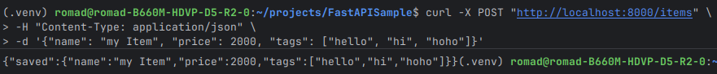
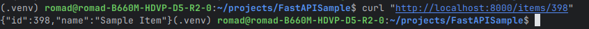
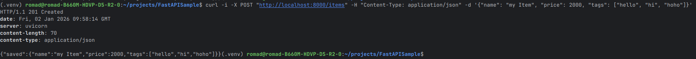
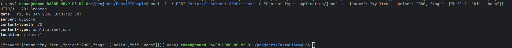
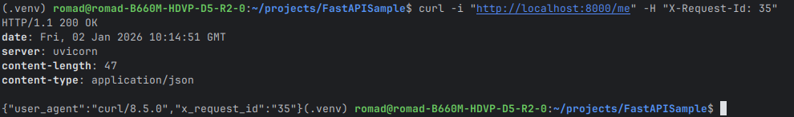

## 1. 설치 및 실행

```bash
pip install fastapi uvicorn[standard]
```

`main.py` 작성:

```python
from fastapi import FastAPI

app = FastAPI()

@app.get("/")
def root():
    return {"message": "hello"}
```

실행:

```bash
uvicorn main:app --reload
```

* 접속: `http://127.0.0.1:8000/`
* 자동 문서:

  * Swagger UI: `http://127.0.0.1:8000/docs`
  * ReDoc: `http://127.0.0.1:8000/redoc`

---

## 2. 라우팅 기본 (GET/POST/Path/Query)

여기서는 다음 두가지만 기억하자.

* 원시 변수로 받기: 기본 타입(int, str, bool 등)
* 객체로 받기: Pydantic 모델
  * **BaseModel 기반 데이터 스키마**
  * 입력 데이터를 **검증**하고 **타입 변환**하며, FastAPI의 **자동 문서화**와 강하게 연동됨

---

### Path Parameter




---

### Query Parameter

가상의 페이지네이션을 받는다고 생각하고 API를 설계해보자.

```python
from typing import Optional
from fastapi import FastAPI

app = FastAPI()

@app.get("/search")
def search(q: str, limit: int = 10, cursor: Optional[str] = None):
    return {"q": q, "limit": limit, "cursor": cursor}
```

curl로 간단하게 API 호출을 시도하면 다음과 같이 결과를 받을 수 있다.



---

### POST + Body

FastAPI는 보통 **Pydantic 모델**로 Body를 받는다.

> 스프링의 @RequestBody와 엮어 생각하자.

#### Pydantic 모델이란?

Pydantic 모델은 **데이터의 구조(스키마)를 코드로 선언하고**, 런타임에 **검증(validation)** 과 **형 변환(parsing/coercion)** 을 수행하는 “데이터 모델”이다. 
FastAPI는 요청/응답에서 이 모델을 핵심 구성요소로 사용한다.

#### Pydantic 모델이 하는 일

1. **스키마 정의**

* 어떤 필드가 있고, 각 필드 타입이 무엇인지 명확히 선언하게 된다.

2. **검증**

* 필수 필드 누락, 타입 불일치, 범위/패턴 위반 등을 자동으로 잡는다.

3. **형 변환**

* 예: `"20"`(문자열)로 들어온 값을 `20`(정수)로 변환하는 등, 지정한 타입으로 파싱한다.

4. **문서화(OpenAPI)**

* FastAPI가 Pydantic 모델을 기반으로 Swagger UI / OpenAPI 스펙을 자동 생성한다.

#### 간단한 예시 (요청 바디)

```python
from pydantic import BaseModel

class ItemCreate(BaseModel):
    name: str
    price: int
    tags: list[str] = []
```

FastAPI에서 사용:

```python
from fastapi import FastAPI

app = FastAPI()

@app.post("/items")
def create_item(item: ItemCreate):
    return {"saved": item}
```

이제 이걸로 curl 요청을 보내보자.


---

### 쿼리 파라미터를 Pydantic 모델로 받기

> 스프링의 @ModelAttribute와 엮어 생각하자.

#### 쿼리 파라미터에도 “모델처럼” 적용 가능

GET 쿼리 파라미터는 보통 함수 인자로 받지만, FastAPI에선 의존성(Dependency)으로 묶어서 “모델처럼” 다룰 수도 있다.


```python
from pydantic import BaseModel
from fastapi import Depends

class SearchQuery(BaseModel):
    q: str
    limit: int = 10
    cursor: str | None = None

@app.get("/search")
def search(params: SearchQuery = Depends()):
    return params
```

> 위에 등장한 Depends()는 FastAPI의 의존성 주입 시스템을 활용하는 방법이다.
> 
> 기본적으로 FastAPI는 파라미터로 들어온 Pydantic 모델을 바디로 보고 처리하지만, Depends()를 사용하면 쿼리 파라미터, 헤더, 쿠키 등 다양한 소스에서 값을 추출할 수 있다.
> 
> 이는 5번 섹션에서 더 자세히 다룬다.

이 또한 curl로 요청을 보내보자.


---

## 3. 응답 모델과 검증 (response_model)

요청/응답 스키마를 분리하면 API 계약을 명확하게 만들 수 있다.

이는 데코레이터 속성 `response_model`을 사용하여 구현할 수 있다.

```python
from fastapi import FastAPI
from pydantic import BaseModel

app = FastAPI()

class Item(BaseModel):
    id: int
    name: str

@app.get("/items/{item_id}", response_model=Item)
def get_item(item_id: int):
    return {"id": item_id, "name": "keyboard", "ignored_field": "x"}
```

여기서 요청을 보내면 다음과 같은 응답을 받게 된다.



여기서 핵심은 `response_model`에 없는 필드 `ignored_field`가  자동으로 제외되었다는 것이다.

실제로는 다음과 같이 사용하면 된다.

```python
@app.get("/items/{item_id}", response_model=Item)
async def get_item(item_id: int):
    return Item(id=item_id, name="Sample Item")
```

---

## 4. 상태 코드, 헤더, 쿠키, 예외 처리

### 4-1. 상태 코드(Status Code)

#### 1) 데코레이터로 기본 상태 코드 지정

```python
from fastapi import FastAPI, status
from pydantic import BaseModel

app = FastAPI()

class ItemCreate(BaseModel):
    name: str
    price: int
    tags: list[str] = []

@app.post("/items", status_code=status.HTTP_201_CREATED)
def create_item(item: ItemCreate):
    return {"saved": item}
```

curl로 호출 시 201 상태 코드를 받게 된다.


#### 2) Response 객체로 상태 코드/헤더를 함께 제어

* 생성 후 `Location` 헤더를 내려주거나,
* 비즈니스 로직에 따라 동적으로 상태 코드를 바꾸는 경우에 사용합니다.

```python
from fastapi import FastAPI, Response, status

app = FastAPI()

@app.post("/items")
def create_item(item: ItemCreate, response: Response):
    response.status_code=status.HTTP_201_CREATED
    response.headers["Location"] = f"/items/1"
    return {"saved": item}
```

이제 다음과 같이 응답을 받을 수 있다.


---

### 4-2. 요청 헤더(Headers)

`Header()`로 특정 헤더를 파라미터로 받을 수 있다. (하이픈 포함 헤더는 자동 변환)

```python
from fastapi import FastAPI, Header

app = FastAPI()

@app.get("/me")
def me(user_agent: str | None = Header(default=None), x_request_id: str | None = Header(default=None)):
    return {"user_agent": user_agent, "x_request_id": x_request_id}
```

이대로 curl로 호출해보자.


> 응답 헤더는 위에서 본 `Response.headers[...]`로 설정할 수 있다.

---

### 4-3. 쿠키(Cookies)

#### 1) 요청 쿠키 읽기

```python
from fastapi import FastAPI, Cookie

app = FastAPI()

@app.get("/session")
def read_session(session_id: str | None = Cookie(default=None)):
    return {"session_id": session_id}
```

#### 2) 응답 쿠키 설정/삭제

* 보안 속성(HTTPOnly/Secure/SameSite) 지정은 다음과 같이 하면 된다.

```python
from fastapi import FastAPI
from fastapi.responses import JSONResponse

app = FastAPI()

@app.post("/login")
def login():
    resp = JSONResponse({"ok": True})
    resp.set_cookie(
        key="session_id",
        value="abc123",
        httponly=True,
        secure=True,          # HTTPS 환경에서 권장
        samesite="lax",
        max_age=60 * 60,      # 1시간
    )
    return resp

@app.post("/logout")
def logout():
    resp = JSONResponse({"ok": True})
    resp.delete_cookie("session_id")
    return resp
```

---

### 4-4. 예외 처리(Exceptions)

#### 1) HTTPException으로 표준 오류 응답

라우터 레벨에서 가장 흔하게 사용하는 방식부터 알아보자.

```python
from fastapi import FastAPI, HTTPException, status

app = FastAPI()

@app.get("/users/{user_id}")
def get_user(user_id: int):
    if user_id == 0:
        raise HTTPException(
            status_code=status.HTTP_404_NOT_FOUND,
            detail="user not found",
        )
    return {"user_id": user_id}
```

#### 2) 커스텀 예외 + 전역 핸들러로 도메인 오류 표준화

* 서비스/도메인 계층에서 예외를 던지고, API 계층에서 공통 포맷으로 매핑하는 패턴이다.
* @ControllerAdvice + @ExceptionHandler(Spring)와 유사하다.

```python
from fastapi import FastAPI, Request, status
from fastapi.responses import JSONResponse

app = FastAPI()

class UserNotFoundError(Exception):
    def __init__(self, user_id: int):
        self.user_id = user_id

@app.exception_handler(UserNotFoundError)
def user_not_found_handler(request: Request, exc: UserNotFoundError):
    return JSONResponse(
        status_code=status.HTTP_404_NOT_FOUND,
        content={
            "error": {
                "code": "USER_NOT_FOUND",
                "message": "user not found",
                "meta": {"user_id": exc.user_id},
            }
        },
    )

@app.get("/users2/{user_id}")
def get_user2(user_id: int):
    if user_id == 0:
        raise UserNotFoundError(user_id)
    return {"user_id": user_id}
```

#### 3) 검증(Validation) 오류 응답 포맷 커스터마이징

* 기본 422 응답을 공통 포맷으로 감싸고 싶을 때 사용한다.

```python
from fastapi import FastAPI, Request
from fastapi.exceptions import RequestValidationError
from fastapi.responses import JSONResponse
from pydantic import BaseModel

app = FastAPI()

@app.exception_handler(RequestValidationError)
def validation_exception_handler(request: Request, exc: RequestValidationError):
    return JSONResponse(
        status_code=422,
        content={
            "error": {
                "code": "VALIDATION_ERROR",
                "message": "invalid request",
                "details": exc.errors(),
            }
        },
    )

class Item(BaseModel):
    name: str
    qty: int

@app.post("/items2")
def create_item2(item: Item):
    return {"ok": True, "item": item}
```

#### 4) 처리되지 않은 예외(500) 전역 처리

* 내부 오류 메시지를 외부로 노출하지 않도록 제한하는 목적이다.
* 실제 서비스에서는 로깅과 함께 사용하자.

```python
from fastapi import FastAPI, Request
from fastapi.responses import JSONResponse

app = FastAPI()

@app.exception_handler(Exception)
def unhandled_exception_handler(request: Request, exc: Exception):
    # 실제 환경에서는 logger.exception(...) 형태로 기록
    return JSONResponse(
        status_code=500,
        content={
            "error": {
                "code": "INTERNAL_SERVER_ERROR",
                "message": "internal server error",
            }
        },
    )
```

---

### 정리 포인트

* **상태 코드**: `status_code=...`(정적) vs `Response`(동적/헤더 동시 제어)
* **헤더**: `Header()`로 입력, `Response.headers[...]`로 출력
* **쿠키**: `Cookie()`로 입력, `set_cookie/delete_cookie`로 출력(보안 속성 중요)
* **예외**: `HTTPException`(단발성) + `exception_handler`(전역/표준화) 조합


---

## 5. 의존성 주입 (Depends) 기본

인증/DB세션/공통 파라미터 처리에 자주 쓰게 되는 의존성 주입에 대해 알아보자.

```python
from fastapi import FastAPI, Depends

app = FastAPI()

def common_params(q: str | None = None, limit: int = 10):
    return {"q": q, "limit": limit}

@app.get("/items")
def list_items(params=Depends(common_params)):
    return params
```

### 1) 코드가 하는 일 (흐름)

```python
def common_params(q: str | None = None, limit: int = 10):
    return {"q": q, "limit": limit}

@app.get("/items")
def list_items(params=Depends(common_params)):
    return params
```

#### 코드 처리 흐름

1. 클라이언트가 `GET /items?q=abc&limit=5` 같은 요청을 보냄
2. `list_items()`를 호출하기 전에, `params=Depends(common_params)`를 보고
3. `common_params()`를 먼저 실행해야 한다고 판단
4. `common_params()`의 인자(`q`, `limit`)를 쿼리 파라미터로부터 자동으로 추출/검증/변환
   * `q`는 없으면 `None`
   * `limit`은 없으면 `10`, 있으면 정수 변환
5. `common_params()`의 반환값(dict)을 `params`에 주입해서 `list_items(params=...)` 실행
6. 결과 반환

즉, `Depends(common_params)`는 “이 엔드포인트는 실행 전에 `common_params` 결과가 필요하다”는 선언이다.

---

### 2) FastAPI가 `common_params`에 인자를 어떻게 채우나

FastAPI는 `common_params`의 시그니처를 분석해서 파라미터들을 요청에서 가져올 수 있는 값으로 자동으로 채운다.


```python
def common_params(q: str | None = None, limit: int = 10):
    return {"q": q, "limit": limit}

@app.get("/items")
def list_items(params=Depends(common_params)):
    return params
```

* `common_params(q, limit)`의 `q`, `limit`은 단순 타입이므로 기본적으로 쿼리에서 채운다.
* `GET /items?q=abc&limit=5`면

  * `q="abc"`, `limit=5`로 호출
* 결과 dict가 `params`로 주입된다.

검증/변환도 같이 수행된다.

* `limit=abc`면 `int` 변환 실패 → 422

---

### 3) `Depends()`에 인자를 안 넣으면?

```python
def search(params: SearchQuery = Depends()):
    ...
```

`Depends()`에 callable을 직접 주지 않으면, FastAPI는 타입 힌트를 보고 결정한다.

* 여기서는 `params: SearchQuery`
* 그래서 의존성을 `SearchQuery`로 간주한다.
* 즉 의미상 다음과 같다고 생각하면 된다.

```python
def search(params: SearchQuery = Depends(SearchQuery)):
    ...
```

그리고 FastAPI는 `SearchQuery`를 “생성”하기 위해 필요한 필드들을 요청에서 모은다.

* `SearchQuery`가 `BaseModel`이든, `dataclass`든, callable이든 원리는 동일하다.
  “호출 가능한 대상의 파라미터/필드에 값을 채워 호출(생성)한 뒤 결과를 주입”

---

### 4) “쿼리/헤더/쿠키/바디”는 누가 결정하나

`Depends`가 결정하는 것이 아니라, **의존성 callable의 파라미터 선언**이 결정한다.

* 단순 타입 파라미터: 기본 Query(상황/선언에 따라 달라질 수 있음)
* `Header(...)`를 쓰면 헤더에서
* `Cookie(...)`를 쓰면 쿠키에서
* `Body(...)`를 쓰면 바디에서
* `Path(...)`를 쓰면 경로에서


```python
from fastapi import Header

def auth(token: str = Header(...)):
    return token
```

`auth`는 `Authorization` 같은 헤더에서 값을 가져오도록 선언한 것이다(정확한 헤더명은 별도 지정 가능).


### 5) 동일 요청 내 캐싱(use_cache)

FastAPI는 기본적으로 **같은 의존성은 한 요청(컨텍스트)에서 1회만 실행**하고 결과를 재사용한다.

> JPA 1차 캐시와 비슷한 용도로 사용할 생각하자.

```python
def dep():
    print("run")
    return 1

@app.get("/")
def e(a=Depends(dep), b=Depends(dep)):
    return a + b
```

* `dep()`는 기본적으로 한 번만 실행되고 `a`, `b`에 동일 결과가 주입된다.
* 이 캐싱을 끄려면 `Depends(dep, use_cache=False)`를 쓰면 된다.


### 6) 의존성 주입의 용도

FastAPI에서 `Depends`를 쓰는 대표 목적/사용처는 다음과 같다.

- 공통 파라미터 처리 재사용 
  - 여러 API에서 동일한 `q`, `limit`, `offset`, `sort` 등을 재사용.
- 인증/인가
  - `get_current_user()` 같은 의존성을 만들어 토큰 검증 및 사용자 객체 주입.
- DB 세션 주입
  - 요청마다 세션 생성 → 핸들러에 주입 → 요청 종료 시 close/rollback 등 정리.
- 공통 전처리/검사
  - 헤더 검사, 요청 컨텍스트 구성, 테넌트 식별, 로깅 컨텍스트 설정 등.

예를 들어,

```python
@app.get("/items")
def list_items(params=Depends(common_params)):
    return params

@app.get("/users")
def list_users(params=Depends(common_params)):
    return params
```

이렇게 하면 두 엔드포인트 모두 `q`, `limit` 규칙을 공유하게 만들 수 있다.

---

### 7) 의존성도 “의존성”을 가질 수 있음 (중첩)

의존성 함수의 파라미터에도 `Depends`를 붙일 수 있다.

```python
def get_token_header(token: str):
    return token

def common_params(
    q: str | None = None,
    limit: int = 10,
    token: str = Depends(get_token_header),
):
    return {"q": q, "limit": limit, "token": token}
```

이 경우 실행 순서는 `get_token_header()` → 결과를 `common_params()`에 주입 → 결과를 `list_items()`에 주입하게 된다.

---

### 8) “생성/정리”가 필요한 의존성: `yield` 패턴

DB 세션처럼 **요청 시작 시 만들고 요청 종료 시 정리**해야 할 때는 `yield`를 쓰면 된다.

```python
from fastapi import Depends
from sqlalchemy.orm import Session

def get_db():
    db = SessionLocal()
    try:
        yield db
    finally:
        db.close()

@app.get("/items")
def list_items(db: Session = Depends(get_db)):
    ...
```

* `yield` 앞: 준비(세션 생성)
* `yield` 뒤: 정리(close)

이 패턴이 FastAPI에서 가장 많이 쓰이는 의존성 형태 중 하나입니다.

* 의존성 함수의 파라미터는 FastAPI가 “요청에서 가져올 수 있는 것”을 자동으로 채웁니다(쿼리/패스/헤더/쿠키/바디 등 규칙에 따라).


> 이를 이용해, 다음에 SQLAlchemy 세션 의존성 + 트랜잭션 처리 패턴까지 구현 가능하다.
> 
> 이에 관련된 내용은 해당 글에서 다뤄보도록 하겠다.


---

## 6. 미들웨어 / CORS

이제 간단한 미들웨어와 CORS 설정 방법을 알아보자.

### CORS 설정

```python
from fastapi import FastAPI
from fastapi.middleware.cors import CORSMiddleware

app = FastAPI()

app.add_middleware(
    CORSMiddleware,
    allow_origins=["http://localhost:3000"],
    allow_credentials=True,
    allow_methods=["*"],
    allow_headers=["*"],
)
```

---

## 7. 프로젝트 구조 예시

```
app/
  main.py
  routers/
    users.py
    items.py
  schemas/
    user.py
  deps.py
```

이를 `main.py`에서 라우터 등록까지 하면 완성이다.

```python
from fastapi import FastAPI
from app.routers import users, items

app = FastAPI()
app.include_router(users.router, prefix="/users", tags=["users"])
app.include_router(items.router, prefix="/items", tags=["items"])
```

---

## 배운 내용
- FastAPI 설치 및 실행 방법
- 라우팅 기본 (GET/POST/Path/Query)
- Pydantic 모델 사용법
- 상태 코드, 헤더, 쿠키, 예외 처리
- Depends를 이용한 의존성 주입
- 간단한 미들웨어 및 CORS 설정 방법